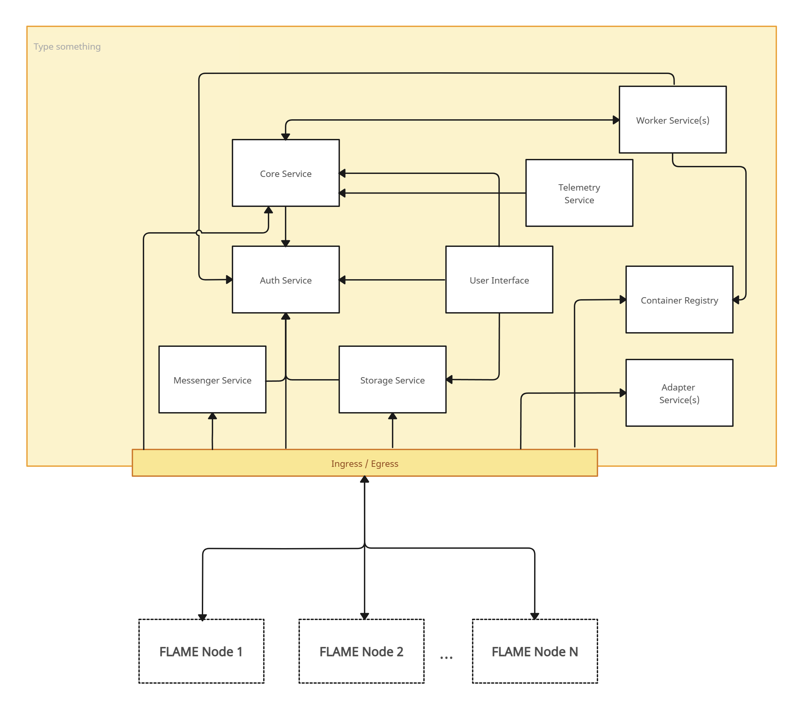

# PrivateAIM Hub 🏥

[![CI][ci-src]][ci-href]
[![CodeQL][codeql-src]][codeql-href]
[![Known Vulnerabilities][snyk-src]][snyk-href]
[![Conventional Commits][conventional-src]][conventional-href]

Central services for the [PrivateAIM](https://privateaim.net) platform — a privacy-preserving analytics infrastructure for federated data analysis across distributed institutions.

**Table of Contents**

- [Architecture](#architecture)
- [Services](#services)
- [Packages](#packages)
- [Quick Start](#quick-start)
- [Contributing](#contributing)
- [License](#license)

## Architecture

<div align="center">



</div>

## Services

| Service | Description | |
|---------|-------------|---|
| **[server-core](apps/server-core)** | Main REST API — analyses, projects, nodes, registries | [![npm][core-badge]][core-npm] |
| **[server-core-worker](apps/server-core-worker)** | Background worker — Docker container execution | [![npm][worker-badge]][worker-npm] |
| **[server-storage](apps/server-storage)** | File/object storage (MinIO/S3) | [![npm][storage-badge]][storage-npm] |
| **[server-telemetry](apps/server-telemetry)** | Log aggregation (VictoriaLogs) | [![npm][telemetry-badge]][telemetry-npm] |
| **[server-messenger](apps/server-messenger)** | Real-time messaging (Socket.io) | [![npm][messenger-badge]][messenger-npm] |
| **[client-ui](apps/client-ui)** | Nuxt 4 web application | |

## Packages

| Package | Description | |
|---------|-------------|---|
| **[kit](packages/kit)** | Core utilities: crypto, domain events, permissions | [![npm][kit-badge]][kit-npm] |
| **[core-kit](packages/core-kit)** | Domain models and types for the core service | [![npm][core-kit-badge]][core-kit-npm] |
| **[core-http-kit](packages/core-http-kit)** | HTTP client for the core API | [![npm][core-http-kit-badge]][core-http-kit-npm] |
| **[core-realtime-kit](packages/core-realtime-kit)** | WebSocket event types | [![npm][core-realtime-kit-badge]][core-realtime-kit-npm] |
| **[storage-kit](packages/storage-kit)** | Storage domain types and HTTP client | [![npm][storage-kit-badge]][storage-kit-npm] |
| **[telemetry-kit](packages/telemetry-kit)** | Telemetry domain types | [![npm][telemetry-kit-badge]][telemetry-kit-npm] |
| **[messenger-kit](packages/messenger-kit)** | Messenger domain types | [![npm][messenger-kit-badge]][messenger-kit-npm] |
| **[client-vue](packages/client-vue)** | Vue 3 component library | [![npm][client-vue-badge]][client-vue-npm] |
| **[server-kit](packages/server-kit)** | Shared server foundation (logging, auth, AMQP, Redis) | [![npm][server-kit-badge]][server-kit-npm] |
| **[server-db-kit](packages/server-db-kit)** | TypeORM utilities | [![npm][server-db-kit-badge]][server-db-kit-npm] |
| **[server-http-kit](packages/server-http-kit)** | HTTP middleware and Swagger | [![npm][server-http-kit-badge]][server-http-kit-npm] |
| **[server-realtime-kit](packages/server-realtime-kit)** | Socket.io server helpers | [![npm][server-realtime-kit-badge]][server-realtime-kit-npm] |
| **[server-telemetry-kit](packages/server-telemetry-kit)** | Telemetry components | [![npm][server-telemetry-kit-badge]][server-telemetry-kit-npm] |
| **[server-core-worker-kit](packages/server-core-worker-kit)** | Worker task definitions | [![npm][server-core-worker-kit-badge]][server-core-worker-kit-npm] |
| **[server-storage-kit](packages/server-storage-kit)** | Storage service components | [![npm][server-storage-kit-badge]][server-storage-kit-npm] |

## Quick Start

```bash
# Install
npm ci

# Build all packages
npm run build

# Run tests
npm run test

# Lint
npm run lint
```

## Contributing

Before starting to work on a pull request, it is important to review the guidelines for
[contributing](./CONTRIBUTING.md) and the [code of conduct](./CODE_OF_CONDUCT.md).
These guidelines will help to ensure that contributions are made effectively and are accepted.

## Credits

If you have any questions, feel free to contact the author [Peter Placzek](https://github.com/tada5hi).

## License

Made with 💚

Published under [Apache 2.0](./LICENSE).

[ci-src]: https://github.com/PrivateAIM/hub/actions/workflows/main.yml/badge.svg
[ci-href]: https://github.com/PrivateAIM/hub/actions/workflows/main.yml
[codeql-src]: https://github.com/PrivateAIM/hub/actions/workflows/codeql.yml/badge.svg
[codeql-href]: https://github.com/PrivateAIM/hub/actions/workflows/codeql.yml
[snyk-src]: https://snyk.io/test/github/PrivateAim/hub/badge.svg
[snyk-href]: https://snyk.io/test/github/PrivateAim/hub
[conventional-src]: https://img.shields.io/badge/Conventional%20Commits-1.0.0-%23FE5196?logo=conventionalcommits&logoColor=white
[conventional-href]: https://conventionalcommits.org

[core-badge]: https://img.shields.io/npm/v/@privateaim/server-core?label=
[core-npm]: https://npmjs.com/package/@privateaim/server-core
[worker-badge]: https://img.shields.io/npm/v/@privateaim/server-core-worker?label=
[worker-npm]: https://npmjs.com/package/@privateaim/server-core-worker
[storage-badge]: https://img.shields.io/npm/v/@privateaim/server-storage?label=
[storage-npm]: https://npmjs.com/package/@privateaim/server-storage
[telemetry-badge]: https://img.shields.io/npm/v/@privateaim/server-telemetry?label=
[telemetry-npm]: https://npmjs.com/package/@privateaim/server-telemetry
[messenger-badge]: https://img.shields.io/npm/v/@privateaim/server-messenger?label=
[messenger-npm]: https://npmjs.com/package/@privateaim/server-messenger

[kit-badge]: https://img.shields.io/npm/v/@privateaim/kit?label=
[kit-npm]: https://npmjs.com/package/@privateaim/kit
[core-kit-badge]: https://img.shields.io/npm/v/@privateaim/core-kit?label=
[core-kit-npm]: https://npmjs.com/package/@privateaim/core-kit
[core-http-kit-badge]: https://img.shields.io/npm/v/@privateaim/core-http-kit?label=
[core-http-kit-npm]: https://npmjs.com/package/@privateaim/core-http-kit
[core-realtime-kit-badge]: https://img.shields.io/npm/v/@privateaim/core-realtime-kit?label=
[core-realtime-kit-npm]: https://npmjs.com/package/@privateaim/core-realtime-kit
[storage-kit-badge]: https://img.shields.io/npm/v/@privateaim/storage-kit?label=
[storage-kit-npm]: https://npmjs.com/package/@privateaim/storage-kit
[telemetry-kit-badge]: https://img.shields.io/npm/v/@privateaim/telemetry-kit?label=
[telemetry-kit-npm]: https://npmjs.com/package/@privateaim/telemetry-kit
[messenger-kit-badge]: https://img.shields.io/npm/v/@privateaim/messenger-kit?label=
[messenger-kit-npm]: https://npmjs.com/package/@privateaim/messenger-kit
[client-vue-badge]: https://img.shields.io/npm/v/@privateaim/client-vue?label=
[client-vue-npm]: https://npmjs.com/package/@privateaim/client-vue
[server-kit-badge]: https://img.shields.io/npm/v/@privateaim/server-kit?label=
[server-kit-npm]: https://npmjs.com/package/@privateaim/server-kit
[server-db-kit-badge]: https://img.shields.io/npm/v/@privateaim/server-db-kit?label=
[server-db-kit-npm]: https://npmjs.com/package/@privateaim/server-db-kit
[server-http-kit-badge]: https://img.shields.io/npm/v/@privateaim/server-http-kit?label=
[server-http-kit-npm]: https://npmjs.com/package/@privateaim/server-http-kit
[server-realtime-kit-badge]: https://img.shields.io/npm/v/@privateaim/server-realtime-kit?label=
[server-realtime-kit-npm]: https://npmjs.com/package/@privateaim/server-realtime-kit
[server-telemetry-kit-badge]: https://img.shields.io/npm/v/@privateaim/server-telemetry-kit?label=
[server-telemetry-kit-npm]: https://npmjs.com/package/@privateaim/server-telemetry-kit
[server-core-worker-kit-badge]: https://img.shields.io/npm/v/@privateaim/server-core-worker-kit?label=
[server-core-worker-kit-npm]: https://npmjs.com/package/@privateaim/server-core-worker-kit
[server-storage-kit-badge]: https://img.shields.io/npm/v/@privateaim/server-storage-kit?label=
[server-storage-kit-npm]: https://npmjs.com/package/@privateaim/server-storage-kit
