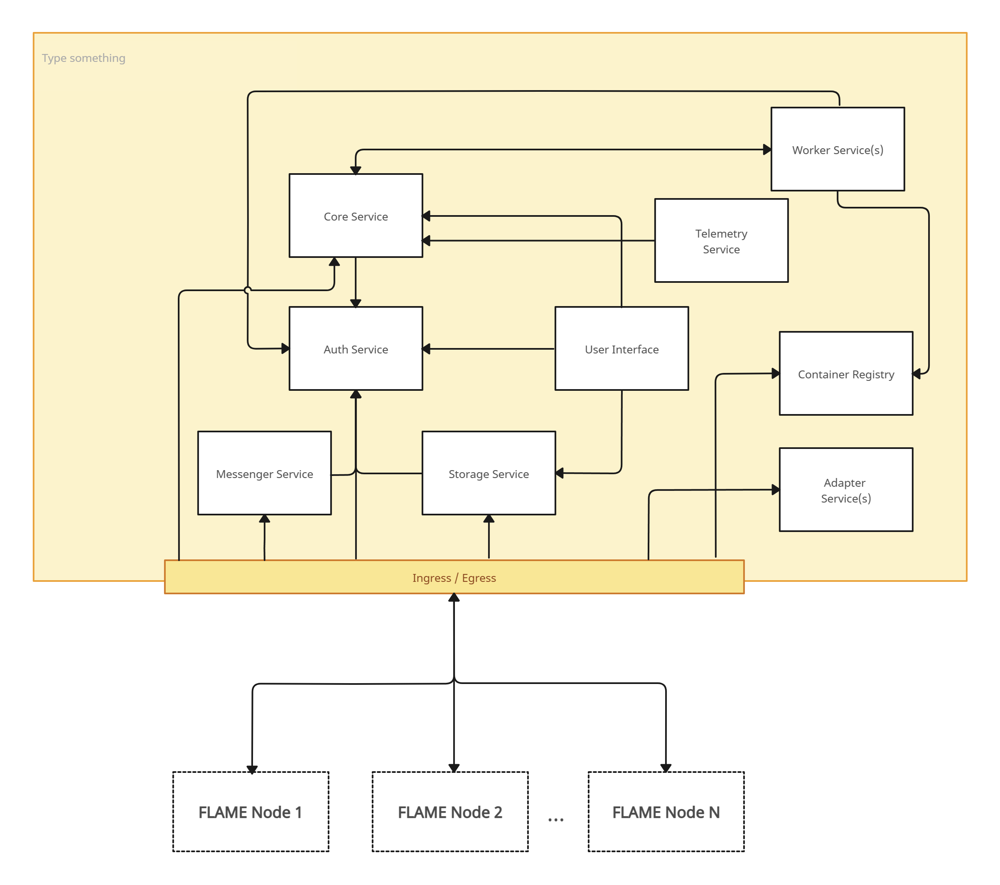

<a href="https://privateaim.de" target="_blank" rel="noopener noreferrer">
  
</a>

[](https://github.com/PrivateAIM/hub/actions/workflows/main.yml)
[](https://github.com/PrivateAIM/hub/actions/workflows/codeql.yml)

[](https://doi.org/10.5281/zenodo.20701036)
[](./LICENSE)

A FLAME analysis is a container that travels to the data. Institutions each run a **node**;
Hub is the centre that decides what runs where — it builds the analysis image, ships it to the
nodes that joined a project, and collects the results, without ever seeing a row of the
underlying data.

This monorepo is the central half: five backend services, a Nuxt frontend, 19 shared
TypeScript libraries, and the documentation site.

**[Documentation](https://hub.docs.privateaim.net)** ·
[Quick start](#quick-start) ·
[Services](#services) ·
[Packages](#packages) ·
[Contributing](./CONTRIBUTING.md)

## Quick start

Requires **Node.js 24**, npm, and Docker. Running the backend locally also expects
[Authup](https://authup.org) (OAuth2), Redis, RabbitMQ, and MySQL or PostgreSQL.

```bash
npm ci          # install
npm run build   # build all packages (Nx, dependency-aware)
npm run test    # run the test matrix
npm run lint    # lint
```

```bash
docker compose up -d                            # MySQL + Postgres

npm run dev --workspace=apps/server-core        # Core API
npm run dev --workspace=apps/client-ui          # Nuxt frontend
npm run dev --workspace=docs                    # Documentation site
```

Every entity endpoint answers with a `{ data, meta }` envelope, and every query-capable `GET`
publishes the vocabulary it accepts under `meta.schema` — so a client never has to read server
source to build a valid query.

📖 [Local setup](https://hub.docs.privateaim.net/guide/development/) ·
[API reference](https://hub.docs.privateaim.net/guide/development/api.html) ·
[Deployment](https://hub.docs.privateaim.net/guide/deployment/)

## Services



Each backend service follows the same hexagonal (ports &amp; adapters) architecture and ships in
the shared `privateaim/hub` Docker image, selected at startup with `SERVICE=<name>`.

| Service | Responsibility |
|---------|----------------|
| [`server-core`](apps/server-core) | Main REST API — analyses, projects, nodes, registries |
| [`server-core-worker`](apps/server-core-worker) | Background worker — Docker image build &amp; distribution |
| [`server-storage`](apps/server-storage) | File and object storage, on MinIO / S3 or the filesystem |
| [`server-telemetry`](apps/server-telemetry) | Log aggregation and events, backed by VictoriaLogs |
| [`server-messenger`](apps/server-messenger) | Durable store-and-forward message broker |
| [`client-ui`](apps/client-ui) | Nuxt 4 web application |

## Packages

Shared libraries, published to npm as `@privateaim/*`.

### Foundation

| Package | Responsibility | Version |
|---------|----------------|---------|
| [`kit`](packages/kit) | Crypto, domain events, permissions, realms | [![npm][kit-badge]][kit-npm] |
| [`errors`](packages/errors) | `HubError`, typed subclasses, code → HTTP-status mapping | [![npm][errors-badge]][errors-npm] |

### Domain kits

Models, contracts and typed clients, one set per service area.

| Package | Responsibility | Version |
|---------|----------------|---------|
| [`core-kit`](packages/core-kit) | Domain models and types for the core service | [![npm][core-kit-badge]][core-kit-npm] |
| [`core-http-kit`](packages/core-http-kit) | HTTP client for the core API | [![npm][core-http-kit-badge]][core-http-kit-npm] |
| [`core-realtime-kit`](packages/core-realtime-kit) | WebSocket event contracts for the core API | [![npm][core-realtime-kit-badge]][core-realtime-kit-npm] |
| [`storage-kit`](packages/storage-kit) | Storage domain types and HTTP client | [![npm][storage-kit-badge]][storage-kit-npm] |
| [`telemetry-kit`](packages/telemetry-kit) | Telemetry domain types and validators | [![npm][telemetry-kit-badge]][telemetry-kit-npm] |
| [`messenger-kit`](packages/messenger-kit) | Messenger contracts and crypto types | [![npm][messenger-kit-badge]][messenger-kit-npm] |
| [`messenger-http-kit`](packages/messenger-http-kit) | HTTP client for the messenger broker | [![npm][messenger-http-kit-badge]][messenger-http-kit-npm] |

### Server kits

Building blocks shared across the backend services.

| Package | Responsibility | Version |
|---------|----------------|---------|
| [`server-kit`](packages/server-kit) | Logging, auth, AMQP, Redis, dependency injection | [![npm][server-kit-badge]][server-kit-npm] |
| [`server-db-kit`](packages/server-db-kit) | TypeORM utilities and migration support | [![npm][server-db-kit-badge]][server-db-kit-npm] |
| [`server-http-kit`](packages/server-http-kit) | HTTP middleware and OpenAPI generation | [![npm][server-http-kit-badge]][server-http-kit-npm] |
| [`server-realtime-kit`](packages/server-realtime-kit) | Socket.io server helpers | [![npm][server-realtime-kit-badge]][server-realtime-kit-npm] |
| [`server-storage-kit`](packages/server-storage-kit) | Storage service components | [![npm][server-storage-kit-badge]][server-storage-kit-npm] |
| [`server-telemetry-kit`](packages/server-telemetry-kit) | Telemetry components and Winston transport | [![npm][server-telemetry-kit-badge]][server-telemetry-kit-npm] |
| [`server-core-worker-kit`](packages/server-core-worker-kit) | Worker task definitions | [![npm][server-core-worker-kit-badge]][server-core-worker-kit-npm] |
| [`server-test-kit`](packages/server-test-kit) | Shared test fakes and helpers | [![npm][server-test-kit-badge]][server-test-kit-npm] |

### Client

| Package | Responsibility | Version |
|---------|----------------|---------|
| [`client-vue`](packages/client-vue) | Vue 3 component library | [![npm][client-vue-badge]][client-vue-npm] |
| [`client-vue-theme`](packages/client-vue-theme) | vuecs-based theme — design tokens and chrome | [![npm][client-vue-theme-badge]][client-vue-theme-npm] |

## Built with

FLAME Hub runs on a stack of open-source libraries maintained by the same author:
**[Authup](https://authup.org)** (identity and access),
**[Routup](https://github.com/routup/routup)** (HTTP routing),
**[Hapic](https://github.com/tada5hi/hapic)** (HTTP clients),
**[validup](https://github.com/tada5hi/validup)** (validation),
**[ilingo](https://github.com/tada5hi/ilingo)** (i18n), and
**[vuecs](https://github.com/tada5hi/vuecs)** (Vue components and theming).

## Contributing

Before starting work on a pull request, please review the
[contributing guidelines](./CONTRIBUTING.md) and the [code of conduct](./CODE_OF_CONDUCT.md).

## Credits and citation

Created and maintained by [Peter Placzek](https://tada5hi.net) ([@tada5hi](https://github.com/tada5hi)),
with contributions from the [PrivateAIM team](https://github.com/PrivateAIM/hub/graphs/contributors).

If you use FLAME Hub in academic work, please cite it — citation metadata lives in
[`CITATION.cff`](./CITATION.cff), which GitHub renders as a **"Cite this repository"** button.

## License

Made with 💚 · Published under [Apache 2.0](./LICENSE).

[kit-badge]: https://img.shields.io/npm/v/@privateaim/kit?label=
[kit-npm]: https://npmjs.com/package/@privateaim/kit
[errors-badge]: https://img.shields.io/npm/v/@privateaim/errors?label=
[errors-npm]: https://npmjs.com/package/@privateaim/errors
[core-kit-badge]: https://img.shields.io/npm/v/@privateaim/core-kit?label=
[core-kit-npm]: https://npmjs.com/package/@privateaim/core-kit
[core-http-kit-badge]: https://img.shields.io/npm/v/@privateaim/core-http-kit?label=
[core-http-kit-npm]: https://npmjs.com/package/@privateaim/core-http-kit
[core-realtime-kit-badge]: https://img.shields.io/npm/v/@privateaim/core-realtime-kit?label=
[core-realtime-kit-npm]: https://npmjs.com/package/@privateaim/core-realtime-kit
[storage-kit-badge]: https://img.shields.io/npm/v/@privateaim/storage-kit?label=
[storage-kit-npm]: https://npmjs.com/package/@privateaim/storage-kit
[telemetry-kit-badge]: https://img.shields.io/npm/v/@privateaim/telemetry-kit?label=
[telemetry-kit-npm]: https://npmjs.com/package/@privateaim/telemetry-kit
[messenger-kit-badge]: https://img.shields.io/npm/v/@privateaim/messenger-kit?label=
[messenger-kit-npm]: https://npmjs.com/package/@privateaim/messenger-kit
[messenger-http-kit-badge]: https://img.shields.io/npm/v/@privateaim/messenger-http-kit?label=
[messenger-http-kit-npm]: https://npmjs.com/package/@privateaim/messenger-http-kit
[server-kit-badge]: https://img.shields.io/npm/v/@privateaim/server-kit?label=
[server-kit-npm]: https://npmjs.com/package/@privateaim/server-kit
[server-db-kit-badge]: https://img.shields.io/npm/v/@privateaim/server-db-kit?label=
[server-db-kit-npm]: https://npmjs.com/package/@privateaim/server-db-kit
[server-http-kit-badge]: https://img.shields.io/npm/v/@privateaim/server-http-kit?label=
[server-http-kit-npm]: https://npmjs.com/package/@privateaim/server-http-kit
[server-realtime-kit-badge]: https://img.shields.io/npm/v/@privateaim/server-realtime-kit?label=
[server-realtime-kit-npm]: https://npmjs.com/package/@privateaim/server-realtime-kit
[server-storage-kit-badge]: https://img.shields.io/npm/v/@privateaim/server-storage-kit?label=
[server-storage-kit-npm]: https://npmjs.com/package/@privateaim/server-storage-kit
[server-telemetry-kit-badge]: https://img.shields.io/npm/v/@privateaim/server-telemetry-kit?label=
[server-telemetry-kit-npm]: https://npmjs.com/package/@privateaim/server-telemetry-kit
[server-core-worker-kit-badge]: https://img.shields.io/npm/v/@privateaim/server-core-worker-kit?label=
[server-core-worker-kit-npm]: https://npmjs.com/package/@privateaim/server-core-worker-kit
[server-test-kit-badge]: https://img.shields.io/npm/v/@privateaim/server-test-kit?label=
[server-test-kit-npm]: https://npmjs.com/package/@privateaim/server-test-kit
[client-vue-badge]: https://img.shields.io/npm/v/@privateaim/client-vue?label=
[client-vue-npm]: https://npmjs.com/package/@privateaim/client-vue
[client-vue-theme-badge]: https://img.shields.io/npm/v/@privateaim/client-vue-theme?label=
[client-vue-theme-npm]: https://npmjs.com/package/@privateaim/client-vue-theme
